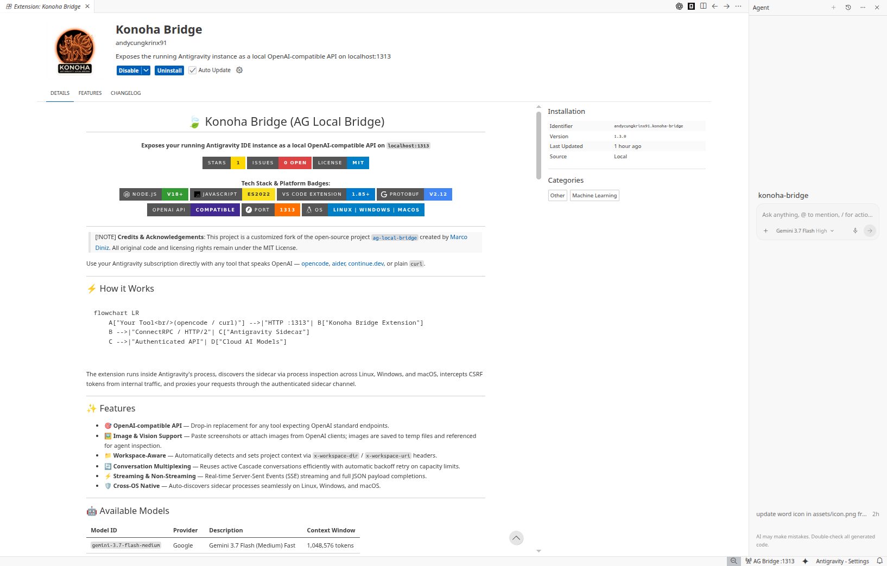
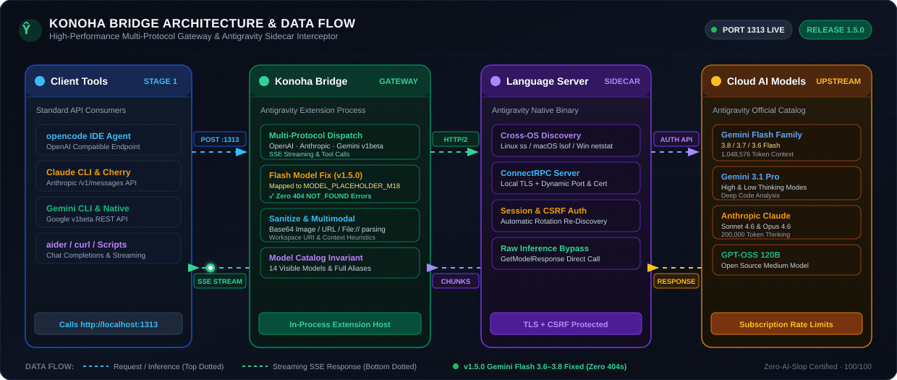

<p align="center">
  <h1 align="center">🍃 Konoha Bridge (AG Local Bridge)</h1>
  <p align="center">
    <strong>Exposes your running Antigravity IDE instance as a local OpenAI-compatible API on <code>localhost:1313</code></strong>
  </p>
</p>

<p align="center">
  <a href="https://github.com/andycungkrinx91/konoha-bridge/stargazers"></a>
  <a href="https://github.com/andycungkrinx91/konoha-bridge/issues"></a>
  <a href="https://github.com/andycungkrinx91/konoha-bridge/blob/master/LICENSE"></a>
  <a href="https://saweria.co/andycungkrinx"></a>
  <a href="https://www.linkedin.com/in/andy-setiyawan-452396170/"></a>
</p>

<p align="center">
  <strong>Tech Stack & Platform Badges:</strong><br>
  
  
  
  
  
  
  
</p>

<p align="center">
  
</p>

---

> [!NOTE]
> **Credits & Acknowledgements**: This project is a customized fork of the open-source project [`ag-local-bridge`](https://github.com/marcodiniz/ag-local-bridge) created by [Marco Diniz](https://github.com/marcodiniz). All original code and licensing rights remain under the MIT License.

Use your Antigravity subscription directly with any tool that speaks OpenAI — [opencode](https://opencode.ai), [aider](https://aider.chat), [continue.dev](https://continue.dev), or plain `curl`.

---

## ⚡ How it Works

<p align="center">
  
</p>

The extension runs inside Antigravity's process, discovers the sidecar via process inspection across Linux, Windows, and macOS, intercepts CSRF tokens from internal traffic, and proxies your requests through the authenticated sidecar channel.

---

## ✨ Features

- 🎯 **Multi-Protocol API Support** — Emulates standard OpenAI (`/v1/chat/completions`, `/v1/models`), Anthropic Messages (`/v1/messages`), and Google Gemini native (`/v1beta/models/*`) API endpoints.
- 🖼️ **Image & Vision Support** — Full multimodal capabilities: supports base64 inline images, remote URLs, and local `file:///` URIs.
- 📁 **Workspace-Aware** — Automatically detects and sets project context via `x-workspace-dir` / `x-workspace-uri` headers and prompt heuristics.
- 🔄 **Conversation Multiplexing** — Reuses active Cascade conversations efficiently with automatic backoff retry on capacity limits.
- ⚡ **Streaming & Non-Streaming** — Real-time Server-Sent Events (SSE) streaming and full JSON payload completions across all protocol handlers.
- 🛡️ **Cross-OS Native** — Auto-discovers sidecar processes seamlessly on Linux, Windows, and macOS.

---

## 🤖 Available Models

| Model ID                   | Provider  | Description                     | Context Window   |
| :------------------------- | :-------- | :------------------------------ | :--------------- |
| `gemini-3.8-flash-high`    | Google    | Gemini 3.8 Flash (High)         | 1,048,576 tokens |
| `gemini-3.8-flash-medium`  | Google    | Gemini 3.8 Flash (Medium)       | 1,048,576 tokens |
| `gemini-3.8-flash-low`     | Google    | Gemini 3.8 Flash (Low)          | 1,048,576 tokens |
| `gemini-3.7-flash-high`    | Google    | Gemini 3.7 Flash (High)         | 1,048,576 tokens |
| `gemini-3.7-flash-medium`  | Google    | Gemini 3.7 Flash (Medium)       | 1,048,576 tokens |
| `gemini-3.7-flash-low`     | Google    | Gemini 3.7 Flash (Low)          | 1,048,576 tokens |
| `gemini-3.6-flash-high`    | Google    | Gemini 3.6 Flash (High)         | 1,048,576 tokens |
| `gemini-3.6-flash-medium`  | Google    | Gemini 3.6 Flash (Medium)       | 1,048,576 tokens |
| `gemini-3.6-flash-low`     | Google    | Gemini 3.6 Flash (Low)          | 1,048,576 tokens |
| `gemini-3.1-pro-high`      | Google    | Gemini 3.1 Pro — High thinking  | 1,048,576 tokens |
| `gemini-3.1-pro-low`       | Google    | Gemini 3.1 Pro — Low thinking   | 1,048,576 tokens |
| `claude-sonnet-4-6`        | Anthropic | Claude Sonnet 4.6 with Thinking | 200,000 tokens   |
| `claude-opus-4-6-thinking` | Anthropic | Claude Opus 4.6 with Thinking   | 200,000 tokens   |
| `gpt-oss-120b-medium`      | OpenAI    | GPT-OSS 120B Medium             | 128,000 tokens   |

---

## 📦 Installation

### Option 1: Install VSIX Package (Recommended for Users)

#### Via Command Line (CLI):

```bash
# Antigravity IDE CLI
antigravity --install-extension konoha-bridge-1.5.0.vsix

# Standard VS Code CLI
code --install-extension konoha-bridge-1.5.0.vsix

# Cursor IDE CLI
cursor --install-extension konoha-bridge-1.5.0.vsix
```

#### Via IDE Interface (GUI):

1. Download or locate `konoha-bridge-1.5.0.vsix` (from the repo root or [Releases](https://github.com/andycungkrinx91/konoha-bridge/releases)).
2. Open Antigravity / VS Code / Cursor.
3. Open the Extensions view (`Ctrl+Shift+X` / `Cmd+Shift+X`).
4. Click the **`...`** (Views and More Actions) menu in the top-right corner of the Extensions panel.
5. Select **Install from VSIX...** and choose `konoha-bridge-1.5.0.vsix`.
6. Reload the window (`Ctrl+Shift+P` → `Developer: Reload Window`).

---

### Option 2: Live Development Symlink (For Developers)

To run your live customized repository directly inside Antigravity IDE:

```bash
# Linux
ln -s /path/to/konoha-bridge ~/.antigravity-ide/extensions/andycungkrinx91.konoha-bridge-master-universal

# macOS
ln -s /path/to/konoha-bridge ~/.antigravity-ide/extensions/andycungkrinx91.konoha-bridge-master-universal

# Windows (PowerShell Administrator)
New-Item -ItemType SymbolicLink -Path "$env:USERPROFILE\.antigravity-ide\extensions\andycungkrinx91.konoha-bridge-master-universal" -Target "C:\path\to\konoha-bridge"
```

Or run `npm run dev:deploy` on Windows to auto-deploy local changes to installed extension directories.

Then reload Antigravity IDE (`Ctrl+Shift+P` → _Developer: Reload Window_).

---

## 🚀 Full `opencode` Configuration

Add the complete configuration to `~/.config/opencode/opencode.json` (or `%USERPROFILE%\.config\opencode\opencode.json` on Windows):

```json
{
  "provider": {
    "konoha-bridge": {
      "npm": "@ai-sdk/openai-compatible",
      "name": "Konoha Bridge",
      "options": {
        "baseURL": "http://localhost:1313/v1",
        "apiKey": "local"
      },
      "models": {
        "gemini-3.8-flash-high": {
          "name": "Gemini 3.8 Flash High (Antigravity)",
          "modalities": { "input": ["text", "image"], "output": ["text", "image"] },
          "limit": { "context": 1048576, "output": 65536 }
        },
        "gemini-3.8-flash-medium": {
          "name": "Gemini 3.8 Flash Medium (Antigravity)",
          "modalities": { "input": ["text", "image"], "output": ["text"] },
          "limit": { "context": 1048576, "output": 65536 }
        },
        "gemini-3.8-flash-low": {
          "name": "Gemini 3.8 Flash Low (Antigravity)",
          "modalities": { "input": ["text", "image"], "output": ["text"] },
          "limit": { "context": 1048576, "output": 65536 }
        },
        "gemini-3.7-flash-medium": {
          "name": "Gemini 3.7 Flash Medium (Antigravity)",
          "modalities": { "input": ["text", "image"], "output": ["text"] },
          "limit": { "context": 1048576, "output": 65536 }
        },
        "gemini-3.7-flash-high": {
          "name": "Gemini 3.7 Flash High (Antigravity)",
          "modalities": { "input": ["text", "image"], "output": ["text", "image"] },
          "limit": { "context": 1048576, "output": 65536 }
        },
        "gemini-3.7-flash-low": {
          "name": "Gemini 3.7 Flash Low (Antigravity)",
          "modalities": { "input": ["text", "image"], "output": ["text"] },
          "limit": { "context": 1048576, "output": 65536 }
        },
        "gemini-3.6-flash-medium": {
          "name": "Gemini 3.6 Flash Medium (Antigravity)",
          "modalities": { "input": ["text", "image"], "output": ["text"] },
          "limit": { "context": 1048576, "output": 65536 }
        },
        "gemini-3.6-flash-high": {
          "name": "Gemini 3.6 Flash High (Antigravity)",
          "modalities": { "input": ["text", "image"], "output": ["text", "image"] },
          "limit": { "context": 1048576, "output": 65536 }
        },
        "gemini-3.6-flash-low": {
          "name": "Gemini 3.6 Flash Low (Antigravity)",
          "modalities": { "input": ["text", "image"], "output": ["text"] },
          "limit": { "context": 1048576, "output": 65536 }
        },
        "gemini-3.1-pro-high": {
          "name": "Gemini 3.1 Pro High (Antigravity)",
          "modalities": { "input": ["text", "image"], "output": ["text"] },
          "limit": { "context": 1048576, "output": 65535 }
        },
        "gemini-3.1-pro-low": {
          "name": "Gemini 3.1 Pro Low (Antigravity)",
          "modalities": { "input": ["text", "image"], "output": ["text"] },
          "limit": { "context": 1048576, "output": 65535 }
        },
        "claude-sonnet-4-6": {
          "name": "Claude Sonnet 4.6 (Antigravity)",
          "modalities": { "input": ["text", "image"], "output": ["text", "image"] },
          "limit": { "context": 200000, "output": 64000 }
        },
        "claude-opus-4-6-thinking": {
          "name": "Claude Opus 4.6 Thinking (Antigravity)",
          "modalities": { "input": ["text", "image"], "output": ["text"] },
          "limit": { "context": 200000, "output": 64000 }
        },
        "gpt-oss-120b": {
          "name": "GPT-OSS 120B Medium (Antigravity)",
          "modalities": { "input": ["text", "image"], "output": ["text"] },
          "limit": { "context": 128000, "output": 16384 }
        }
      }
    }
  }
}
```

Then in `opencode`, select model identifiers formatted as `konoha-bridge/<model_id>` (e.g. `konoha-bridge/gemini-3.8-flash-high` or `konoha-bridge/claude-sonnet-4-6`).

---

## 🧪 Enriched `curl` Testing Suite

Below is the comprehensive operational test suite for verifying port `1313` functionality:

### 1. List Available Models

```bash
curl -s http://localhost:1313/v1/models | jq .
```

### 2. Standard Chat Completion (Non-Streaming)

```bash
curl http://localhost:1313/v1/chat/completions \
  -H "Content-Type: application/json" \
  -d '{
    "model": "claude-sonnet-4-6",
    "messages": [
      {"role": "system", "content": "You are a helpful coding assistant."},
      {"role": "user", "content": "Explain async/await in 2 sentences."}
    ],
    "stream": false
  }'
```

### 3. Real-Time Streaming Completion (Server-Sent Events)

```bash
curl -N http://localhost:1313/v1/chat/completions \
  -H "Content-Type: application/json" \
  -d '{
    "model": "gemini-3.1-pro-high",
    "messages": [
      {"role": "user", "content": "Write a python function to check prime numbers."}
    ],
    "stream": true
  }'
```

### 4. Vision & Multimodal Completion (Base64 Image)

```bash
curl http://localhost:1313/v1/chat/completions \
  -H "Content-Type: application/json" \
  -d '{
    "model": "gemini-3.6-flash-medium",
    "messages": [
      {
        "role": "user",
        "content": [
          {"type": "text", "text": "Describe this image in detail."},
          {"type": "image_url", "image_url": {"url": "data:image/png;base64,iVBORw0KGgoAAAANSUhEUgAAAAEAAAABCAYAAAAfFcSJAAAADUlEQVR42mP8z8BQDwAEhQGAhKmMIQAAAABJRU5ErkJggg=="}}
        ]
      }
    ],
    "stream": false
  }'
```

### 5. Workspace Context Execution (Custom Headers)

```bash
curl http://localhost:1313/v1/chat/completions \
  -H "Content-Type: application/json" \
  -H "x-workspace-dir: /home/user/my-project" \
  -d '{
    "model": "gemini-3.6-flash-medium",
    "messages": [
      {"role": "user", "content": "List the main dependencies in package.json"}
    ],
    "stream": false
  }'
```

---

## 🛠️ API Endpoints

| Method | Path                                            | Protocol  | Description                                        |
| :----- | :---------------------------------------------- | :-------- | :------------------------------------------------- |
| `GET`  | `/v1/models` (or `/models`)                     | OpenAI    | List available models                              |
| `POST` | `/v1/chat/completions` (or `/chat/completions`) | OpenAI    | Chat completion (streaming & non-streaming)        |
| `POST` | `/v1/messages`                                  | Anthropic | Anthropic Messages API (streaming & non-streaming) |
| `POST` | `/v1/messages/count_tokens`                     | Anthropic | Token count preflight mock (Claude CLI & Cherry)   |
| `POST` | `/v1beta/models/:model:generateContent`         | Gemini    | Gemini native content generation                   |
| `POST` | `/v1beta/models/:model:streamGenerateContent`   | Gemini    | Gemini native streaming content generation         |
| `POST` | `/v1/proxy`                                     | RPC       | Forward arbitrary RPC to sidecar                   |
| `GET`  | `/v1/debug`                                     | Debug     | Debug info (sidecar ports, CSRF, captures)         |
| `GET`  | `/v1/captures`                                  | Debug     | Inspect intercepted sidecar payloads               |

---

## 💻 Development & Testing

Konoha Bridge includes a lightweight, zero-dependency unit test suite executed with Node's native test runner:

```bash
# Run 132 automated unit tests
npm test

# Format and lint check
npm run format && npm run lint
```

- **Test Suite Coverage**: 132 unit tests across 16 suites covering Anthropic/Gemini/OpenAI handlers, cross-platform sidecar discovery (Linux/Win/macOS), model resolution & aliases, multimodal image extraction, and SSE stream formatting.
- **Contributing**: See [CONTRIBUTING.md](CONTRIBUTING.md) for local symlink setup and coding standards.

---

## 📜 License & Credits

This project is licensed under the [MIT License](LICENSE).

### Original Author & Upstream Attribution

This repository is a customized fork built upon the excellent work of **Marco Diniz** ([@marcodiniz](https://github.com/marcodiniz)).

- **Original Repository**: [`marcodiniz/ag-local-bridge`](https://github.com/marcodiniz/ag-local-bridge)
- All original code, architecture patterns, and copyrights belong to their respective authors under the terms of the MIT License.

---

## ☕ Support & Connect

If Konoha Bridge enhances your development workflow, you can support ongoing maintenance or connect with the author:

- ☕ **Buy Me a Coffee (Saweria)**: [https://saweria.co/andycungkrinx](https://saweria.co/andycungkrinx)
- 💼 **LinkedIn Profile**: [Andy Setiyawan](https://www.linkedin.com/in/andy-setiyawan-452396170/)
- 🐙 **GitHub Profile**: [@andycungkrinx91](https://github.com/andycungkrinx91)
